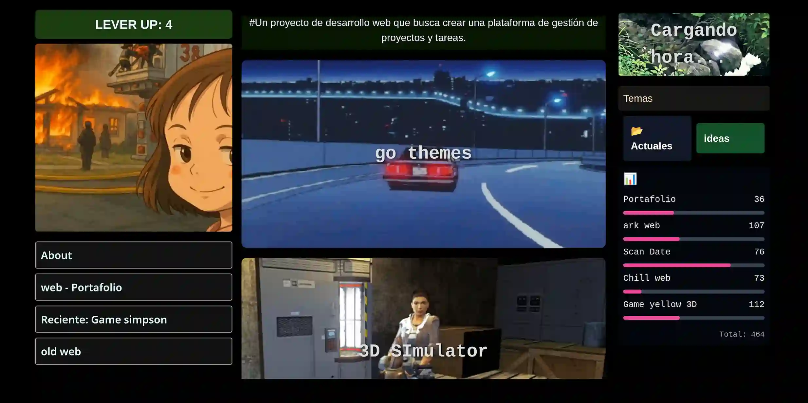

# ArkWeb -  RPG Interactivo

Portafolio personal con estilo RPG interactivo donde los visitantes pueden explorar mis proyectos como si fuera un juego.

##  Características

- **Sistema de Niveles RPG**: Los visitantes ganan XP al interactuar
- **Dashboard Personalizado**: Visualización de habilidades en gráficos interactivos
- **Diseño Inmersivo**: Estética oscura con elementos de videojuego
- **Totalmente Responsive**: Adaptable a móviles y tablets

## 🛠 Tecnologías

<!--  -->

- **Frontend**: HTML5, Tailwind CSS, JavaScript
- **Herramientas**: Git, Vite, Figma

##  Cómo Jugar/Usar

1. Explora las diferentes secciones
2. Interactúa con los elementos para ganar XP
3. Desbloquea contenido al subir de nivel
4. Descubre los easter eggs ocultos

## 🌐 Demo en Vivo

## 📄 Licencia

MIT © [Jahwh]